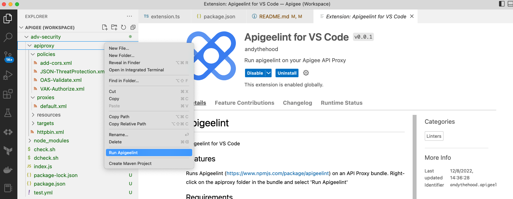

# apigeelint

Apigeelint for VS Code

## Features

Runs Apigeelint (https://www.npmjs.com/package/apigeelint) on an API Proxy bundle.\

To use, right-click on the apiproxy folder in the bundle and select 'Run Apigeelint'

## Requirements

This section describes requirements and how to install and configure them.\
\
npm install --location=global apigeelint

## Extension Settings
This extension contributes the following settings:

* `apigeelint.formatter`: The report formatter to use (default: visualstudio.js)
* `apigeelint.profile`: The Apigee proxy profile type: ApigeeX or ApigeeEdge

## Known Issues

No known issues.

## Release Notes

Releases

### 0.0.1

Initial release of Apigeelint for VS Code

